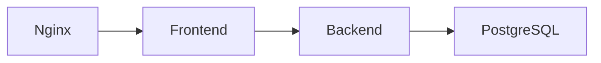

# Projeto: Docker Compose Guess Game

## Sumário
1. [Descrição da Aplicação](#descrição-da-aplicação)
2. [Estrutura de Containers](#estrutura-de-containers)
    - [Arquitetura dos componentes](#arquitetura-dos-componentes)
3. [Estrutura do Projeto](#estrutura-do-projeto)
4. [Boas Práticas Adotadas](#boas-práticas-adotadas)
5. [Atualizar componentes](#atualizar-componentes)
6. [Escalabilidade](#escalabilidade)
7. [Requisitos](#requisitos)
8. [Instruções de Instalação e Execução](#instruções-de-instalação-e-execução)
    - [1. Clonar o repositório](#1-clonar-o-repositório)
    - [2. Navegar até o diretório do projeto](#2-navegar-até-o-diretório-do-projeto)
    - [3. Construir e iniciar os containers](#3-construir-e-iniciar-os-containers)
    - [4. Acessar a aplicação](#4-acessar-a-aplicação)
9. [Como Limpar o Projeto](#como-limpar-o-projeto)

## Descrição da Aplicação

Este projeto é uma implementação prática de orquestração baseada no repositório GuessGame. A aplicação envolve um jogo em que os participantes tentam adivinhar uma palavra secreta.

### A arquitetura é composta por:

- **Frontend**: Desenvolvido em React, oferece a interface para os jogadores interagirem com o jogo.
- **Backend**: Construído em Node.js, é responsável pela lógica central do jogo, gerenciamento de sessões e integração com o banco de dados.
- **Banco de Dados PostgreSQL**: Utilizado para armazenar dados persistentes, como tentativas e resultados dos jogadores.

O principal objetivo deste projeto é aplicar boas práticas de containerização e orquestração, utilizando Docker e Docker Compose para garantir um ambiente consistente, modular e escalável.

## Estrutura de Containers

O ambiente é organizado utilizando Docker e Docker Compose, garantindo modularidade e isolamento para cada serviço essencial da aplicação. A estrutura contempla os seguintes componentes:

- **Nginx**: Serve o frontend e atua como proxy reverso, direcionando as requisições para o backend. Em cenários com múltiplas instâncias do backend, funciona como balanceador de carga.
- **Frontend**: Aplicação em React que oferece a interface gráfica para os usuários interagirem com o jogo.
- **Backend**: API desenvolvida em Node.js, responsável por executar a lógica do jogo e orquestrar a comunicação com o banco de dados.
- **PostgreSQL**: Banco de dados relacional que armazena informações persistentes, como jogadores, tentativas e palavras.

### Arquitetura dos componentes



Essa arquitetura modular favorece a escalabilidade, uma vez que o backend pode ser replicado para atender a um maior volume de requisições, enquanto o proxy reverso do Nginx distribui a carga entre as instâncias disponíveis.

## Estrutura do Projeto

```bash
guess_game/
├── README.md              # Documentação do projeto
├── docker-compose.yml     # Configuração do Docker Compose
├── backend/               # Código e lógica do servidor backend
│   ├── Dockerfile         # Dockerfile para o backend
│   ├── run.py             # Script de inicialização da aplicação backend
│   ├── start-backend.sh   # Script para iniciar o backend
│   ├── requirements.txt   # Dependências do projeto backend
│   ├── repository/        # Módulos de integração com diferentes bancos de dados
│   └── tests/             # Testes automatizados do backend
└── frontend/              # Código do frontend React
    ├── Dockerfile         # Dockerfile para o frontend
    ├── nginx.conf         # Configuração do servidor Nginx
    ├── public/            # Arquivos públicos e estáticos
    └── src/               # Código-fonte do frontend
```

---

## Boas Práticas Adotadas
- **Containerização com Docker e Docker Compose**: Todos os serviços estão encapsulados em contêineres, garantindo consistência entre ambientes (desenvolvimento, homologação e produção) e isolamento adequado, minimizando conflitos de dependências.
- **Proxy Reverso com Nginx**: O Nginx opera como proxy reverso, direcionando o tráfego do frontend e roteando requisições do cliente para o backend. Essa abordagem melhora a gestão do tráfego, aumenta a segurança e simplifica o balanceamento de carga.
- **Arquitetura Modular e Independente**: A aplicação foi desenhada com a separação clara entre os serviços de frontend, backend e banco de dados PostgreSQL. Essa modularidade facilita a manutenção, promove a escalabilidade e permite implantações independentes ou atualizações contínuas.
- **Persistência de Dados Confiável**: O banco de dados PostgreSQL utiliza volumes Docker para garantir a integridade e a persistência dos dados, mesmo em casos de reinicialização ou falhas nos contêineres.
- **Segregação de Redes para Segurança**: A aplicação foi configurada com múltiplas redes Docker. O frontend e backend compartilham uma rede de aplicação para comunicação interna, enquanto o banco de dados reside em uma rede isolada, acessível apenas pelo backend, reforçando a segurança e mitigando o risco de acessos indevidos.

## Atualizar componentes

A atualização de qualquer componente é direta e intuitiva. Basta modificar o Dockerfile ou os arquivos relacionados ao serviço específico e, em seguida, reconstruir o ambiente com o seguinte comando:

```bash
docker-compose up --build
```

Isso garantirá que todas as alterações sejam aplicadas e que as novas versões dos serviços sejam executadas sem interrupções significativas.

## Escalabilidade 
O sistema permite escalabilidade horizontal do backend para lidar com um maior número de requisições. Esse ajuste é feito diretamente no arquivo docker-compose.yml, definindo o número de réplicas necessárias. Para isso, você pode incluir a configuração abaixo:

```yaml
backend:
  build:
    context: .
  restart: always
  depends_on:
    - db
  deploy:
    replicas: n
```
No campo replicas, substitua n pelo número desejado de instâncias.

Esse recurso permite distribuir a carga entre várias réplicas, otimizando a performance e aumentando a disponibilidade do serviço. Ferramentas como Nginx garantirão que o tráfego seja balanceado entre as instâncias de backend disponíveis.

## Requisitos

Para executar este projeto corretamente, certifique-se de que os seguintes softwares estejam instalados:

- [Docker](https://docs.docker.com/engine/install/): Necessário para criar e gerenciar os containers que compõem a aplicação.
- [Docker Compose](https://docs.docker.com/compose/install/): Usado para orquestrar múltiplos containers, facilitando o gerenciamento dos serviços.
- [Git](https://git-scm.com/book/en/v2/Getting-Started-Installing-Git): Para clonar o repositório e manter o controle de versão do projeto.

Certifique-se de que cada uma das ferramentas está instalada e configurada corretamente no seu sistema antes de prosseguir para a próxima etapa.

## Instruções de Instalação e Execução

### 1. Clonar o repositório

Primeiro, você deve clonar o repositório do projeto para a sua máquina local. Isso garantirá que você tenha acesso a todos os arquivos necessários.
```shell
git clone https://github.com/kimidomaru/docker_practice.git
```

### 2. Navegar até o diretório do projeto

Após o clone, entre no diretório recém-criado. A partir desse diretório, você poderá executar todos os comandos relacionados ao projeto.

```shell
cd docker_practice
```

### 3. Construir e iniciar os containers

Este comando irá construir as imagens Docker e iniciar os containers necessários.
- O parâmetro --build garante que o Docker construa novas imagens, incorporando quaisquer alterações no código.
- Se tudo correr bem, o backend, frontend e o banco de dados estarão em execução.

```shell
docker-compose up --build
```

### 4. Acessar a aplicação

Com todos os containers em execução, abra o navegador e acesse: [http://localhost](http://localhost) para interagir com a aplicação.

Se o ambiente estiver configurado corretamente, a interface da aplicação será carregada e estará pronta para uso.

## Como Limpar o Projeto
Se você quiser interromper a aplicação e limpar o ambiente, siga estas instruções.

1. **Parar e remover os containers**
Este comando interrompe e remove todos os containers em execução.

Isso é útil se você precisar parar a aplicação ou resolver problemas de configuração.

```bash
docker-compose down
```

2. **Remover volumes associados**
Se você quiser apagar completamente todos os dados persistidos nos volumes Docker, inclua o parâmetro -v.

Este comando é útil para garantir que nenhuma configuração ou dado persistente permaneça entre execuções.

```
docker-compose down -v
```
